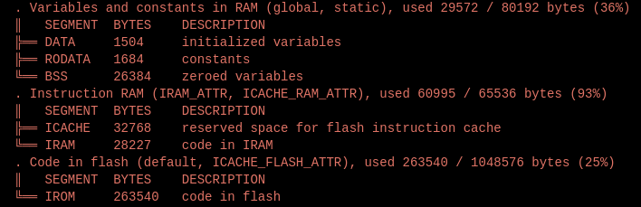

# ESP side: How to use it

## Board architecture:
- ESP8266
- Carrier Board
- Grove - Temperature & Humidity Sensor (DHT11)
- Grove - Chainable RGB LED
- Grove - 16x2 LCD
- Grove - Light Sensor
- Grove - Button

## We defined two use cases:
- Manual -> Uncomment the `#define MANUAL` in `config.h`
- Automatic -> nothing to do, the server backend will handle everything and work by itself.

## How to make the project work:
- Change all `MACROS` in `config.h` (`ip`, `backend-ip`, `wifi-ssid`, `wifi-password`...)
- Start the backend using:
    **For backend** (At root of homeManager):
    - `docker build -t backend-service:latest .`
    ___
    **For services** (At root of sensor-service):
    - `docker build -t component-service:latest .`
    ___
    **For the app** (At root of this directory):
    - `docker compose up -d`
- Prepare and flash the esp: 
    - Open the `first_tests/first_tests.ino` in the `arduino ide`.
    - In the `arduino ide`, install the required libraries in your Arduino IDE (see below).
    - Plug the esp and flash it.
- Configure the ihm:
    - Go to node-red: `http://localhost:1880/`
    - Import the `flows.json` file.
    - Install the `node-red-dashboard` library.
    - Go to the node `esp12/+/HUMIDITY/+` and add a MQTT broker with your ip
    - Select that newly created server for all the `MQTT` nodes (humidity, luminosity and temperature)
    - Change the topic of the buttons `MQTT` nodes **harcoding** the ip of the esp.
    - Change the ip of all the `http requests` nodes.
    - Deploy your ihm and access it
- Enjoy your homeManager

## Work Done:

For this third part, here is how the system should behave:
- Create a WebClient that sends requests to a server. (That will later be the backend of our system)
- Create a WebServer that will handle requests from the backend. These requests are:
  - Get the current temperature and humidity values.
  - Get the current luminosity value.
  - Get the current state of the button (pressed or not).
  - Switch on a led (or switch it off).
  - Display things on the LCD.
  - Change the threshold for the luminosity sensor.
  - Change the threshold for the humidity sensor.

The ESP will communicate with the backend via MQTT and HTTP depending on the use (frequent communication -> MQTT, non frequent -> HTTP)

All of those endpoints are implemented to handle more devices in the future. They all have identifiers to distinguish between different devices. (For the moment limited to one device of each type quoted above)

## HTTP Endpoints:
- `/lcd/{id}/{line}` : Displays things on the LCD.
- `/led/{id}/{state}` : Switches on the led (or switches it off).
- `/humidity_threshold/{value}` : Changes the threshold for the humidity sensor.
- `/luminosity_threshold/{value}` : Changes the threshold for the luminosity sensor.

## MQTT publications:
The esp8266 is publishing to topics (`esp12/+/+/+`). The luminosity, humidity and temperature sensors are publishing to different topics.
(using the `PubSubClient` library)

## Remarks:
Two alternatives were proposed for the implementation of a server on the ESP8266:

https://arduino-esp8266.readthedocs.io/en/latest/esp8266wifi/server-examples.html
AND
https://github.com/esp8266/Arduino/tree/master/libraries/ESP8266WebServer

Advantages of the first one:
- Already included in the ESP8266 core library, no need to install anything else.
- Already used for the Wifi module

Disadvantages of the first one:
- No endpoint creation possible, only one endpoint is available. (http://{ip}/)

Size comparison:

After this comparison, we decided to use the second library (ESP8266WebServer) for the server implementation. That allowed us to create endpoints properly and have a clean implementation.

## How to use:
1. Install the required libraries in your Arduino IDE (see below).
2. Connect the devices to the carrier board.
3. Upload the code to your ESP8266 board.
4. Open the Serial Monitor to see the output from the temperature and humidity sensor.
5. Play with the sensors to see the full behaviour of the system.

## Useful docs:

- Arduino ide
- Temperature and humidity sensor: https://wiki.seeedstudio.com/GroveTemperatureAndHumidity_Sensor
- LED : https://wiki.seeedstudio.com/Grove-Chainable_RGB_LED/
- LCD : https://wiki.seeedstudio.com/Grove-16x2_LCD_Series
- Luminosity sensor : please download the library available on moodle
- PubSubClient : Available on the arduino ide library manager

## Faced issues:
- For the leds:
We use the backend and microservices for the sake of the exercice. When we push a button, the backend is queries and says the led to switch on.
This leads to extreme latency. When we push the button in automatic mode, it takes around 20 seconds to switch on/off the led.
In real conditions, the button should directly switch on/off the led (like manual mode).

- For the leds again:
We used a very generic way of calling the endpoints. The backend always need the ip of the esp to perform actions to it. When the esp itself asks for something, it works perfectly.
When an other device wants to control it (ex: the ihm), it should know the ip of the esp. That is not clean and doesn't reflect reality but that was the only way to do it.

- For the threshold:
It doesn't work in the ihm, the endpoint on the backend is not working properly. But all the logic is impemented and is worth looking into.

